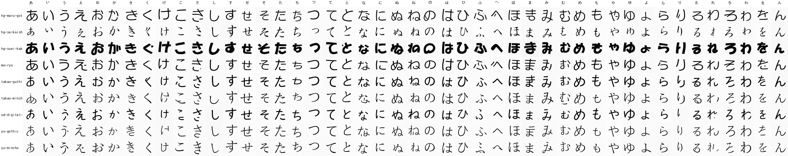
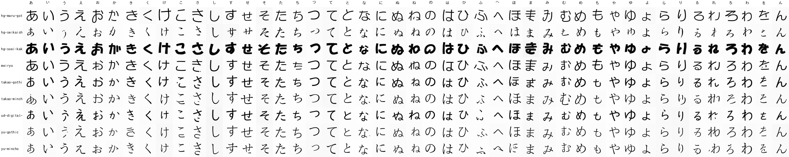

# Nine-font Baseline 64

個別`font_id`条件で9フォント・全46文字を学習し、多フォントでもConditional DDPMが各文字とフォント特徴を再現できるか確認した基準実験です。次の未観測組み合わせ実験に対する比較対象でもあります。

## 概要

| 項目 | 値 |
|---|---|
| 画像 | 64 × 64、8-bitグレースケールPNG |
| 文字 | 現代ひらがな46文字 |
| フォント | 9フォント |
| 学習画像 | 41,400枚（46文字 × 9フォント × 100変形） |
| 条件 | 文字ID、個別`font_id`、拡散時刻 |
| モデル | 条件付きU-Net |
| パラメータ | 4,754,817 |
| 拡散過程 | 1,000 timesteps、cosine beta schedule |
| 学習 | 100 epochs、32,400 optimizer steps |
| バッチサイズ | 128 |
| EMA decay | 0.999 |
| 最終ノイズ予測loss | 0.005915 |
| 最終epoch所要時間 | 30秒 |
| 生成 | DDIM、50 steps |
| 比較seed | 20260730 |

使用した`font_id`:

1. `hg-maru-gothic`
2. `hg-seikaisho`
3. `hg-soei-kakupop`
4. `meiryo`
5. `takao-gothic`
6. `takao-mincho`
7. `ud-digital-kyokasho`
8. `yu-gothic`
9. `yu-mincho`

各画像はグリフを中央揃えし、縦横±4 px、0.90〜1.10倍、±3度の変形を加えて生成しました。各文字の先頭サンプルだけは無変形です。

## 生成結果

### 直接学習したモデル



9フォントの太さ、丸み、明朝系の強弱、正楷書系の筆致が条件ごとに現れています。大半の文字は判読可能ですが、一部には筆画の欠け、不要な点、別文字に近い崩れがあります。

### EMAモデル



`ema_decay=0.999`と32,400更新の組み合わせにより、前回のTakao基準実験と異なり、EMAモデルも学習へ十分に追従しました。通常モデルと同等以上に安定した文字が多く、特に「よ」は曲線と終筆が自然にまとまっています。一方、細い書体を中心に一部の文字には欠けや異形が残ります。

両一覧は、同じ文字・同じseed・同じ初期ノイズ・同じDDIMステップ数で生成しています。

## 推論モデル

通常モデルとEMAモデルを、それぞれ推論専用アーカイブとしてGit LFSで管理しています。optimizer、mixed precision scaler、もう一方の重みは含みません。

| ファイル | 重み | サイズ | SHA-256 |
|---|---|---:|---|
| `model/inference.pt` | 直接学習したモデル | 19,052,503 bytes | `e79ea260386eaddfb7264b0eab5e255d998f40ce2c917e06bc4a945937b79db0` |
| `model/inference-ema.pt` | EMAモデル | 19,052,879 bytes | `be542da3ec8c55da37caab3603c6ddfc2db6b13d883fa1ecd934f9802d365edf` |

両モデルともepoch 100、global step 32,400です。

通常モデルから生成:

```bash
python scripts/sample.py \
  --checkpoint artifacts/nine-font-baseline-64/model/inference.pt \
  --output outputs/nine-font-baseline-64/archive-raw \
  --steps 50 \
  --seed 20260730
```

EMAモデルから生成:

```bash
python scripts/sample.py \
  --checkpoint artifacts/nine-font-baseline-64/model/inference-ema.pt \
  --output outputs/nine-font-baseline-64/archive-ema \
  --steps 50 \
  --seed 20260730
```

推論専用アーカイブには重みが1組だけ入っているため、EMAアーカイブを使う場合も`--ema-model`は指定しません。

## 再現コマンド

```bash
python scripts/generate_dataset.py \
  --config configs/dataset.nine-font-baseline.json

python scripts/train.py \
  --config configs/train.nine-font-baseline.json

python scripts/sample.py \
  --checkpoint outputs/nine-font-baseline-64/latest.pt \
  --output outputs/nine-font-baseline-64/samples/raw \
  --steps 50 \
  --seed 20260730

python scripts/sample.py \
  --checkpoint outputs/nine-font-baseline-64/latest.pt \
  --output outputs/nine-font-baseline-64/samples/ema \
  --steps 50 \
  --seed 20260730 \
  --ema-model
```

推論専用モデルの書き出し:

```bash
python scripts/export_model.py \
  --checkpoint outputs/nine-font-baseline-64/latest.pt \
  --output artifacts/nine-font-baseline-64/model/inference.pt

python scripts/export_model.py \
  --checkpoint outputs/nine-font-baseline-64/latest.pt \
  --output artifacts/nine-font-baseline-64/model/inference-ema.pt \
  --ema-model
```

## フォントと配布範囲

Takao GothicとTakao MinchoはWSL上のTakaoフォントを使用しました。残り7フォントはWindowsにインストールされたフォントをWSLから参照しています。

フォントファイル、41,400枚の学習画像、完全な学習checkpoint、個別生成PNGはリポジトリに含めません。成果物として比較用一覧画像と推論専用モデルだけを保存します。

## 制約

- 全9フォント・全46文字を学習しているため、この実験だけでは文字内容とフォント特徴の分離を証明できません。
- 学習・検証分割や文字認識器・フォント分類器による定量評価は行っていません。
- 生成品質の評価は同一seedの一覧画像による定性的な比較です。
- 次の実験では`hg-soei-kakupop`の「は・ひ・ふ・へ・ほ」を除外し、未観測組み合わせへの汎化を検証します。
