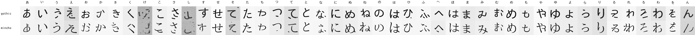
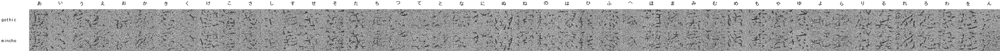

# Takao Baseline 64

最初に正しいConditional DDPMがひらがなを生成できるか確認した、2フォントの基準実験です。

## 概要

| 項目 | 値 |
|---|---|
| 画像 | 64 × 64、8-bitグレースケールPNG |
| 文字 | 現代ひらがな46文字 |
| フォント | Takao Gothic、Takao Mincho |
| 学習画像 | 9,200枚（46文字 × 2フォント × 100変形） |
| モデル | 文字・書体・時刻条件付きU-Net |
| パラメータ | 4,753,025 |
| 拡散過程 | 1,000 timesteps、cosine beta schedule |
| 学習 | 100 epochs、7,200 optimizer steps |
| バッチサイズ | 128 |
| 最終ノイズ予測loss | 0.007470 |
| 生成 | DDIM、50 steps |
| 比較seed | 20260730 |

学習画像は、各グリフを中央揃えした後、縦横移動、拡大縮小、回転を加えて生成しました。学習時には画像ごとに拡散時刻と正規分布ノイズを新しくサンプリングしています。

## 生成結果

### 直接学習したモデル



大半の文字は判読でき、ゴシックと明朝の違いも現れています。一部には余計な点、筆画の崩れ、別文字に近い形があります。

### EMAモデル



この実験では`ema_decay=0.9999`を使用しました。7,200更新では追従が遅すぎ、EMA重みに初期状態の影響が大きく残ったため、生成結果にはノイズが多く残っています。後続設定では`0.999`へ変更しました。

両一覧は、同じ文字・同じseed・同じ初期ノイズ・同じDDIMステップ数で生成しています。

## 推論モデル

`model/inference.pt`には、直接学習した通常モデルの推論に必要な情報だけを保存しています。optimizer、mixed precision scaler、EMA重みは含みません。

| 項目 | 値 |
|---|---|
| ファイルサイズ | 19,045,207 bytes |
| SHA-256 | `c73e3856e4a940eb7667d70db5e9b9713d439485410bb13bfe64091453b37602` |
| 重み | 直接学習したモデル |
| epoch | 100 |
| global step | 7,200 |

Git LFSで管理しています。

## 再現コマンド

```bash
python scripts/generate_dataset.py \
  --config configs/dataset.example.json

python scripts/train.py \
  --config configs/train.example.json

python scripts/sample.py \
  --checkpoint outputs/takao-baseline-64/latest.pt \
  --steps 50 \
  --seed 20260730
```

推論専用モデルの書き出し:

```bash
python scripts/export_model.py \
  --checkpoint outputs/takao-baseline-64/latest.pt \
  --output artifacts/takao-baseline-64/model/inference.pt
```

## フォント

TakaoフォントはIPAフォントを基にしたフォントファミリーで、IPAフォントライセンスv1.0の下で配布されています。

- Takao Gothic: `/usr/share/fonts/truetype/takao-gothic/TakaoGothic.ttf`
- Takao Mincho: `/usr/share/fonts/truetype/takao-mincho/TakaoMincho.ttf`
- Upstream: <https://launchpad.net/takao-fonts>

フォントファイルおよび生成した全学習画像は、このリポジトリには含めていません。

## 制約

- 各書体につき1フォントだけなので、条件ラベルと個別フォントが一対一です。
- 学習・検証分割を設けた定量評価ではありません。
- EMA設定は短い学習に適していませんでした。
- 文字・個別フォント条件を使う多フォント実験への移行前の基準結果です。
